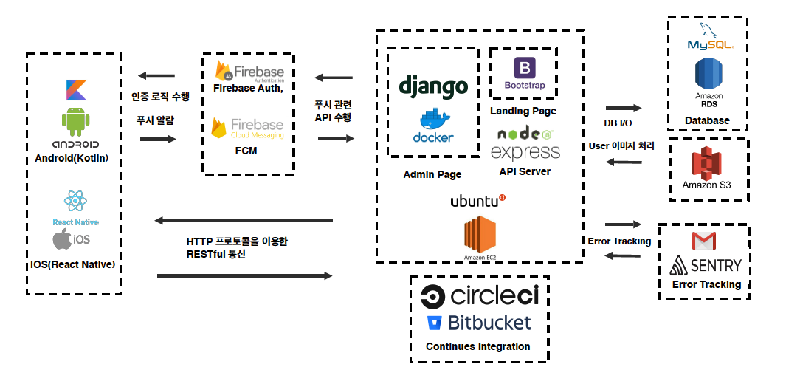
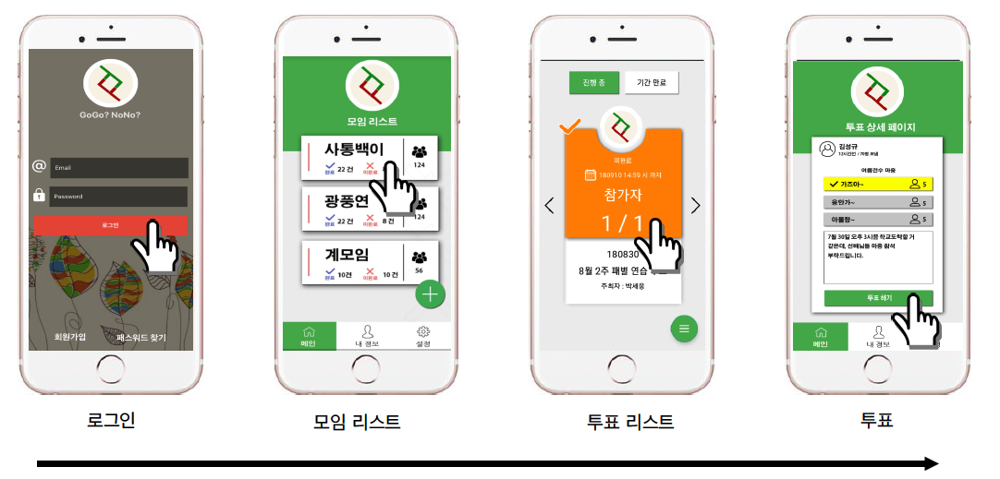
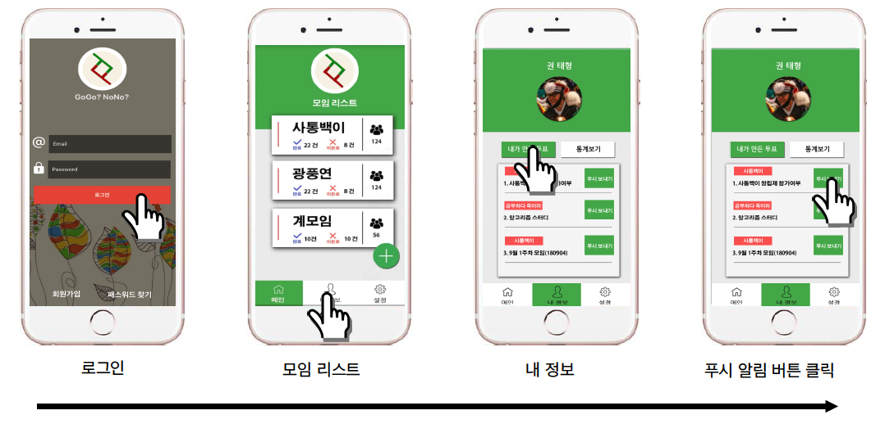
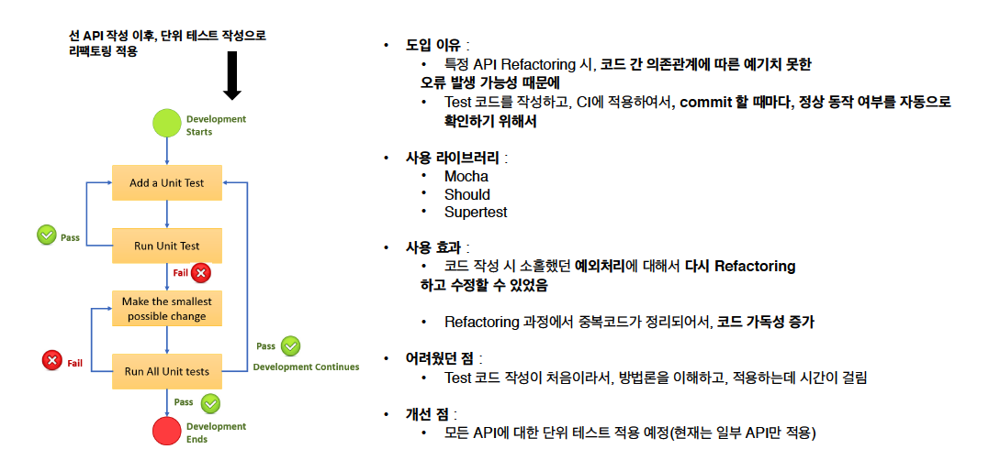
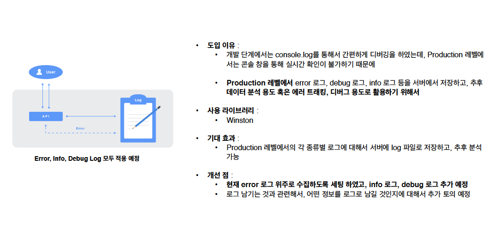
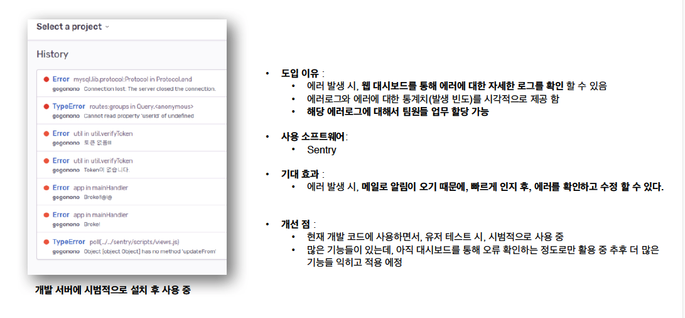
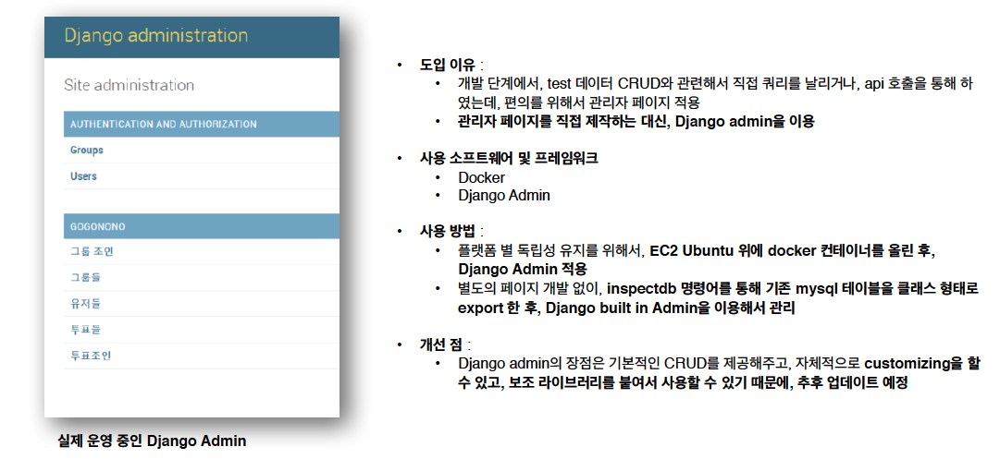

# GGNN(GoGo? NoNo?) - 간편 모임 투표 앱

**위 코드에서 fcm, aws 및 기타 config 설정들을 모두 삭제한채, 나머지 코드만 업로드 하였습니다.**

> GGNN - 간편 모임 투표 앱 (팀 프로젝트)

## Summary

- 동아리 행사 시, 행사 참가 여부에 대한 투표를 하고, 실시간으로 인원파악을 위해서 제작
- 매번 행사 때 마다, 동아리원들에게 연락을 하여서, 참여여부를 묻곤 하는데, 실시간으로 확인하기 힘든 문제가 있었고, 이를 해결하기 위해서 만든 앱

## Prerequisites

- Node JS
- Express
- AWS RDS / EC2 / S3
- Firebase Cloud Messaging / Authentication
- Django admin
- Docker

## Architecture

## Dependencies

| Dependence         | Version        |
| ------------------ | -------------- |
| @sentry/node       | 4.4.2          |
| aws-sdk            | 2.339.0        |
| body-parser        | 1.18.3         |
| express            | 4.16.3         |
| fcm-node           | 1.3.0          |
| firebase           | 5.4.0          |
| firebase-admin     | 6.0.0          |
| fs                 | 0.0.1-security |
| moment             | 2.22.2         |
| multer             | 1.4.0          |
| multer-s3          | 2.7.0          |
| mysql              | 2.16.0         |
| nodemon            | 1.18.4         |
| swagger-ui-express | 3.0.10         |
| winston            | 3.1.0          |
| yamljs             | 0.3.0          |
| mocha              | 5.2.0          |
| should             | 13.2.3         |
| supertest          | 3.3.0          |

## Functions

### 기본 앱 동작(투표하기)

### 기본 앱 동작(푸시 알림 보내기)

### 단위테스트(Mocah, Should, Supertest)

### 로그 관리(Winston)

### 에러 트래킹(Sentry)

### 관리자 페이지(Docker && Django admin)

